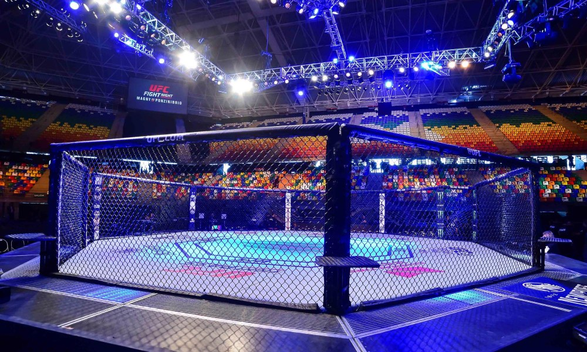

# Predicting fight outcomes with basic fighter stats in the UFC (MMA)

Using a data set from 1993-2019 of over 5000 fights, multiple machine learning models are created and evaluated.
In the final step the models are used to predict the 5 main fights in UFC 259.

# The models:
* Gaussian Naive Bayes
* Logistic Regression
* Decision Tree
* KNN
* Random Forest
* Support Vector Classifier
* XGBoost
* Artificial Neural Network

Evaluation:
* Average score from K-fold cross validation

# The UFC

The UFC is the largest MMA promotion company in the world and features some of the highest-level fighters in the sport. As of 2020 the UFC has held over 500 events features fighters in 12 different weight divisions. The data set is a collection of over 5000 fights from the years 1993 to 2019.

Being a huge fan of MMA, I wanted to design some Machine Learning Models to experiment with the avaiable data. The goal is to make a model to predict fight outcomes, and see if it has any usefulness in real world application.

In this particular notebook I reduce the data down to (what I felt was) core stats, so despite this dataset having over 145 features, I reduce it down to height, weight, reach, win streak, lose streak, total wins, total losses, and total draws. In the future I will apply more features to see if the model accuracy improves at all.

# Model Accuracy
## Training accuracy:
* Gaussian Naive Bayes - 59.95% 
* Logistic Regression - 62.37%
* Decision Tree - 54.22%
* KNN - 55.11%
* Random Forest - 59.86%
* Support Vector Classifier - 62.70%
* XGBoost - 58.74%
* Artificial Neural Network - 58.74%

## Testing accuracy:
* Logistic Regression - 62.53%
* Random Forest - 61.83%
* Support Vector Classifier - 63.84%

# UFC 259: Blachowicz vs Adesanya

### SVC Model Winner Prediction:
* Fight 1 - Israel Adesanya
* Fight 2 - Megan Anderson
* Fight 3 - Aljamain Sterling
* Fight 4 - Drew Dober
* Fight 5 - Aleksandar Rakic

### Random Forest Model Winner Prediction:
* Fight 1 - Israel Adesanya
* Fight 2 - Megan Anderson
* Fight 3 - Aljamain Sterling
* Fight 4 - Islam Makhachev
* Fight 5 - Aleksandar Rakic

### Logistic Regression Model Winner Prediction:
* Fight 1 - Israel Adesanya
* Fight 2 - Megan Anderson
* Fight 3 - Aljamain Sterling
* Fight 4 - Drew Dober
* Fight 5 - Aleksandar Rakic

Please view the full notebook with code: [MMA_Fight_Predictions_UFC259.ipynb](https://github.com/danielbsimpson/MMA-ML-Predictions/blob/main/MMA_Fight_Predictions_UFC259.ipynb)
